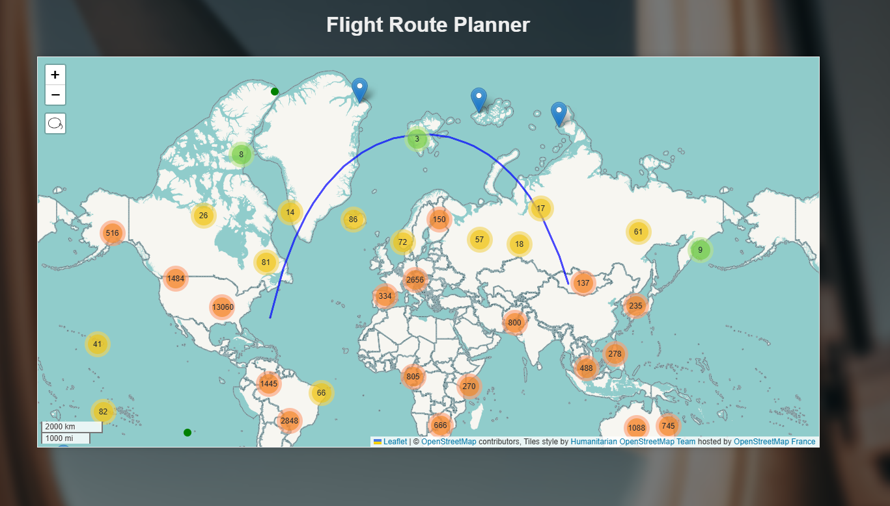

# Flight Route Planner



## Description

Flight Route Planner is a web-based application that helps users find optimal flight routes between airports. Built with React and powered by advanced pathfinding algorithms, it provides an interactive map interface for visualizing and planning flight paths.

## Key Features

- Interactive map interface using Leaflet.js
- A* pathfinding algorithm for optimal route calculation
- Weather impact consideration for route planning
- Clustered airport markers for better visualization
- Real-time distance calculations using Haversine formula
- Great circle route visualization for flight paths

## Technologies Used

- React.js
- Leaflet.js for mapping
- Vite as build tool
- Axios for API requests
- MarkerCluster for airport grouping
- CSS for responsive design

## Getting Started

### Prerequisites

- Node.js (v12 or higher)
- npm or yarn package manager

### Installation

```bash
# Clone the repository
git clone https://github.com/bariscanatakli/flight-route-planner

# Install dependencies
npm install

# Start development server
npm run dev
```

## Project Structure

* [src](vscode-file://vscode-app/c:/Users/baris/AppData/Local/Programs/Microsoft%20VS%20Code/resources/app/out/vs/code/electron-sandbox/workbench/workbench.html) - Source code
  * `/functions` - Core functionality
    * `/algorithm` - A* implementation and pathfinding logic
    * `/map` - Map-related functions and utilities
  * `/pages` - React components for different pages
  * `/data` - Airport data and other static resources

## Features

1. **Interactive Map**
   * Click to select start and end airports
   * Visual representation of flight paths
   * Clustered markers for better performance
2. **Route Planning**
   * Optimal path calculation using A* algorithm
   * Consideration of elevation and distance
   * Weather impact analysis (configurable)
3. **User Interface**
   * Clean, responsive design
   * Easy navigation between different sections
   * Informative about pages and algorithm explanation*
